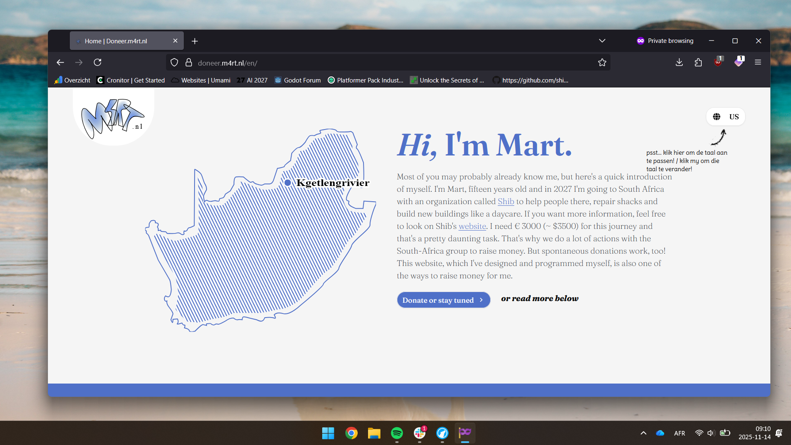

## Doneer.m4rt.nl

This website was improved a lot during the [Midnight](https://midnight.hackclub.com/?code=464) program, this gave me solid motivation to actually finish it!

This is a donation website for a journey I'm making in 2027 to the municipality of Kgetlengrivier, South Africa. I've made this myself using Astro, Tailwind and sprinkled in a bit of Shadcn/ui. Hope you like it!

I used a bit of AI (Copilot and Cursor) to help me fix gnarly bugs and ship faster. Especially the i18n part used AI because there was a library that did not work like expected and I had to find another one, Cursor helped me with that.

### Build Instructions

In case you need to make changes for whatever reason, here are some contribution/build instructions:

1. Fork the project and clone it on your machine
2. Make sure you have Node.js and npm installed and run `npm i`
3. Make some changes
4. For local testing use `npm run dev`
5. If you want to run this on a server like I did on my Raspberry Pi, you can just make sure Node and NPM are installed on the target machine, then run `npm run build`, serve it using something like `pm2` and reverse proxy it using Caddy. If you want to use Vercel, you need to install the adapter for that, current is Node. For that please refer to the documentation of Astro.
